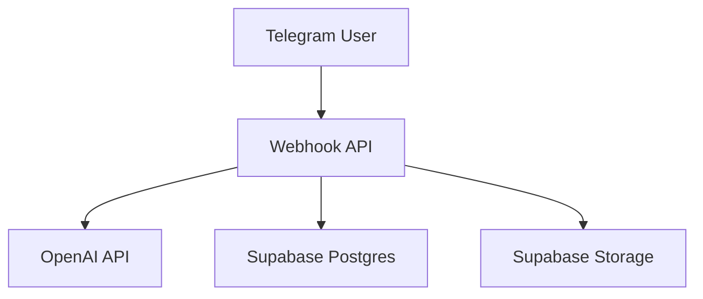
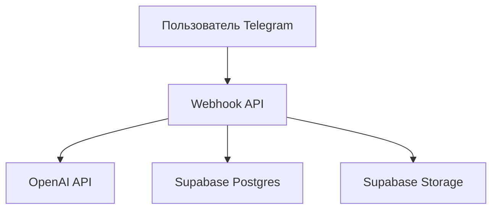

# MyAI

## English
## Problem
Telegram bots need AI features (chat, voice, files) with persistent history and manageable backend integration.
## Solution
MyAI is a Next.js service integrating Telegram, OpenAI, and Supabase for conversational workflows and media/document processing.
## Tech Stack
- Node.js, TypeScript
- Next.js
- OpenAI API
- Supabase (Postgres + Storage)
- Telegram Bot API
## Architecture
```text
app/
api/
docs/
package.json
```

## Features
- Text chat with AI
- Voice STT/TTS flows
- Image/document processing
- Chat history persistence in Supabase
## How to Run
```bash
npm install
cp .env.example .env.local
npm run dev
```

## Русский
## Проблема
Telegram-боту с AI нужны чат, голос и работа с файлами с сохранением истории и надежной backend-интеграцией.
## Решение
MyAI — это сервис на Next.js с интеграцией Telegram, OpenAI и Supabase для диалогов и обработки медиа/документов.
## Стек
- Node.js, TypeScript
- Next.js
- OpenAI API
- Supabase (Postgres + Storage)
- Telegram Bot API
## Архитектура
```text
app/
api/
docs/
package.json
```

## Возможности
- AI-чат
- Голосовые STT/TTS сценарии
- Обработка изображений и документов
- Сохранение истории диалогов в Supabase
## Как запустить
```bash
npm install
cp .env.example .env.local
npm run dev
```
